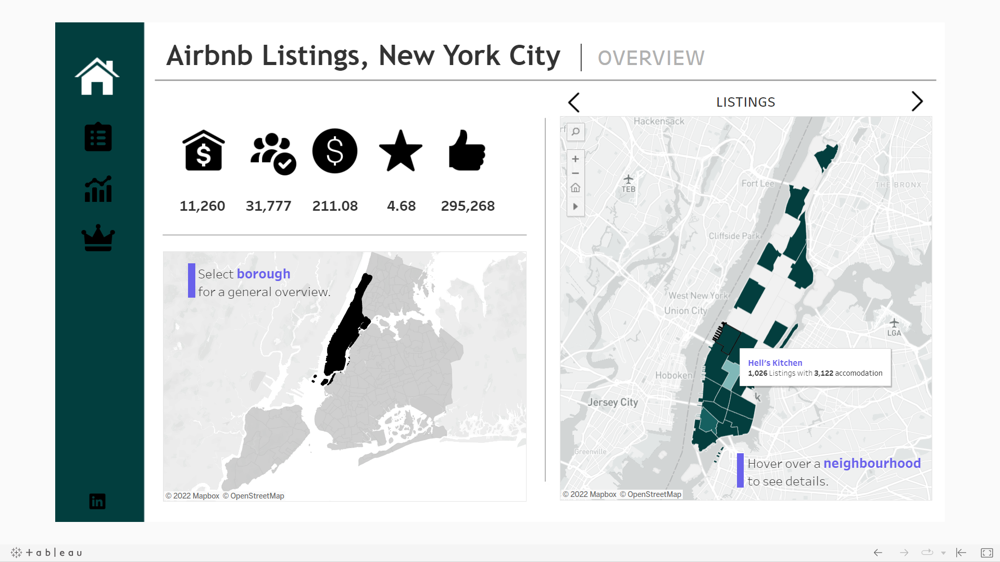
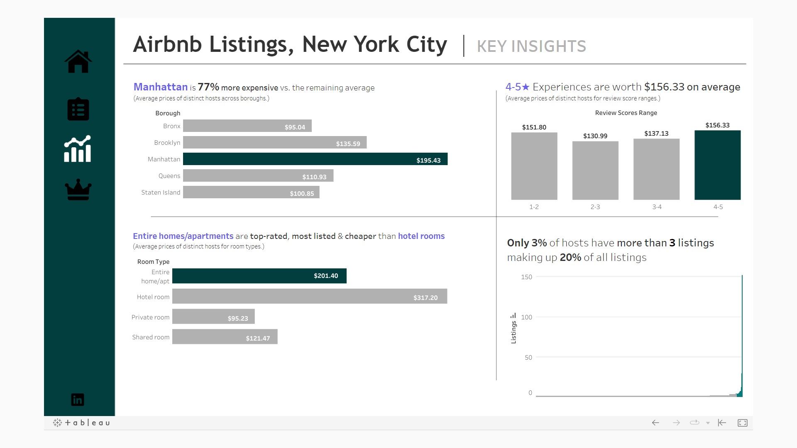
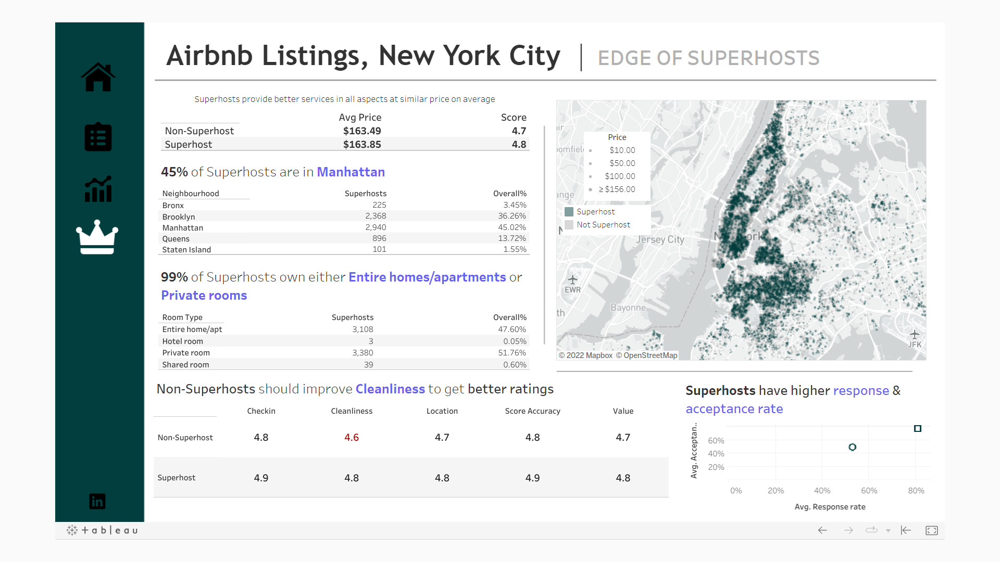

 

Exploratory Data Analysis 
[Tableau](https://public.tableau.com/app/profile/sujay.bahumik/viz/AirbnbListingsNewYorkCity/Home#1)  
[SQL](https://github.com/s1dewalker/Airbnb-listings-NYC/blob/main/SQLQuery_Airbnb_NewYork.sql)  
[Python](https://github.com/s1dewalker/Airbnb-listings-NYC/blob/main/Airbnb%20correlation.ipynb)  

### Viewing the data 
* Querying in SSMS (SQL Server Management Studio) using self joins, CTEs, procedures, group by to view the data required 
* Data Cleaning
* Data Analysis (Q/A)
* Data Transformation for dashboard visualization 

### Dashboard 
* Overview: listings, accomodations available, average price($), average rating, and total reviews info per borough 

* Filtering: Giving the options to find the desired location and attaching the links to the website for more details 

* Key Insights: Displaying the insights on the boroughs, room types, prices, reviews, and hosts 

* Superhosts v Non Superhosts: Figuring out the edge of superhosts 

 

### Tech Stack 
* Excel
* SQL (SQL Server Management Studio)
* Tableau
* Figma
* Mapbox
* Python (pandas, seaborn, matplotlib)
